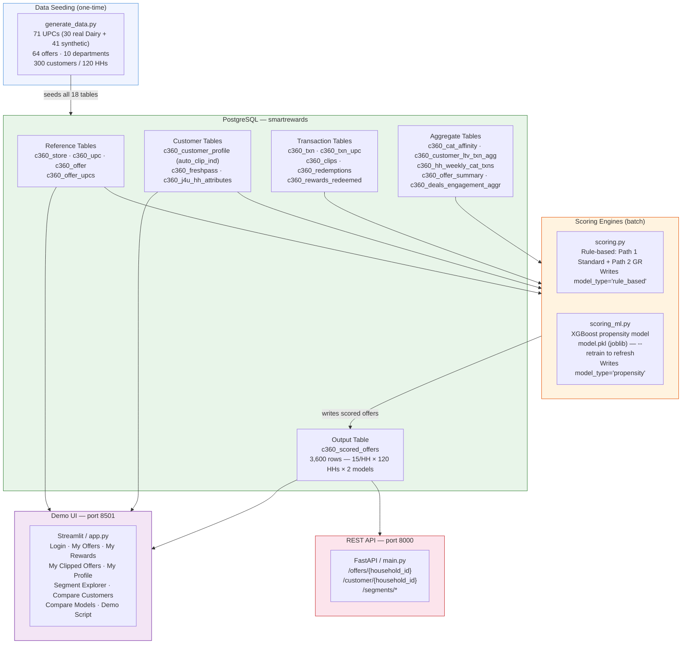
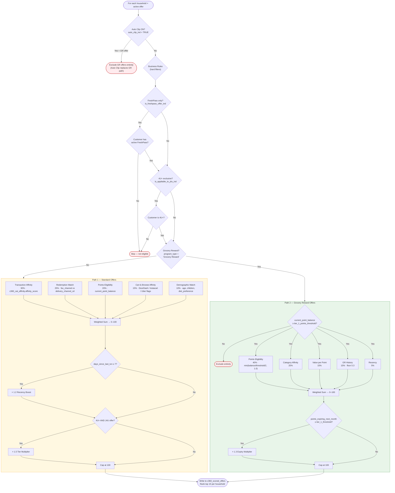
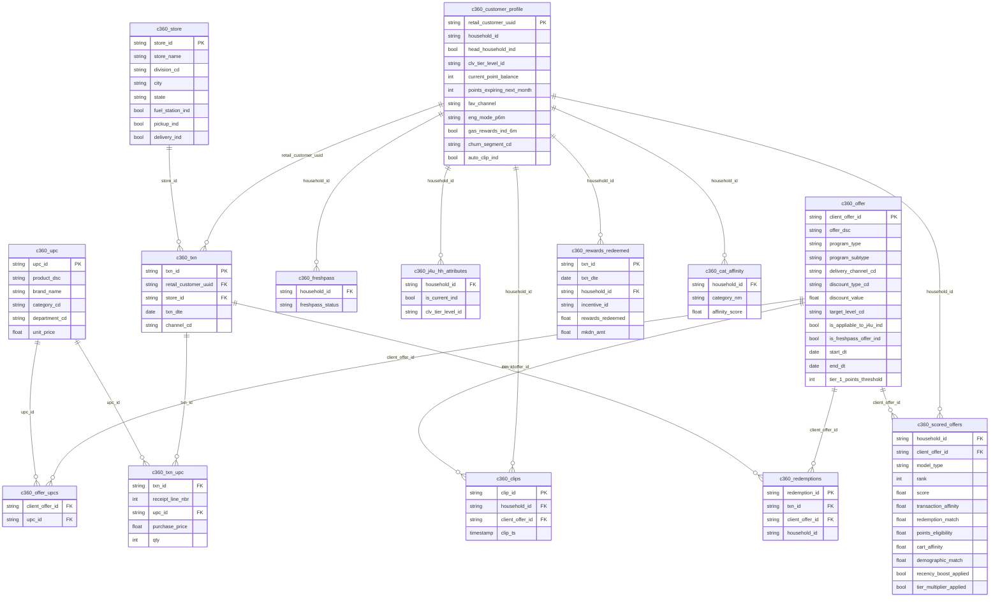
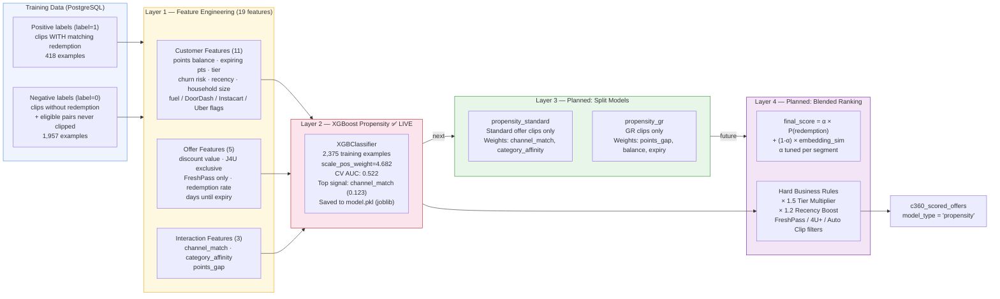
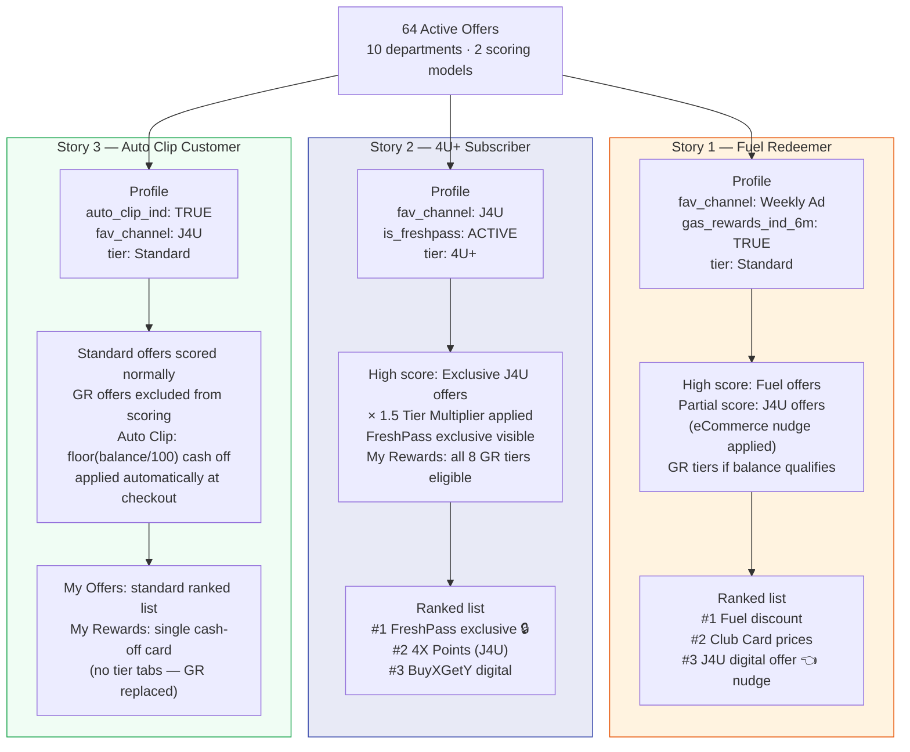

# SmartRewards — Architecture Diagrams

---

## 1. System Overview

End-to-end data flow across all four components.

---

## 2. Scoring Engine — Decision Flow

How every customer–offer pair is scored.

---

## 3. Database — Table Groups & Key Relationships

---

## 4. ML Architecture — Current & Planned

**Milestones:**

| # | Deliverable | Status |
|---|---|---|
| 4a | Feature engineering pipeline | ✅ Done — 19 features across 3 groups |
| 4b | XGBoost model + scoring | ✅ Done — AUC 0.522, model.pkl persisted |
| 4c | SHAP values in UI | 🔵 Next — per-prediction feature contributions |
| 4d | Split Standard / GR models | 🔵 Backlog |
| 4e | Score-based GR UI ranking | 🔵 Backlog (depends on 4d) |
| 4f | Embedding model | 🔵 Future — needs >10k redemption events |

---

## 5. Offer Personalisation — Three Customer Stories

